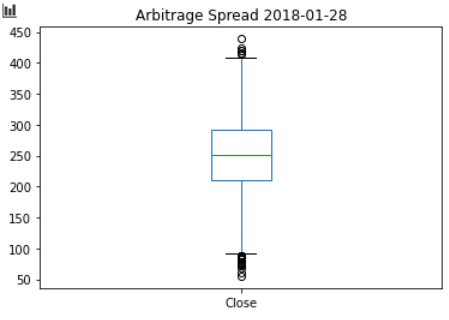
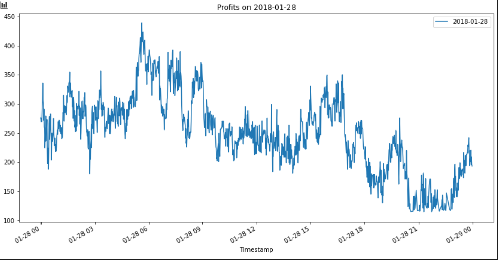
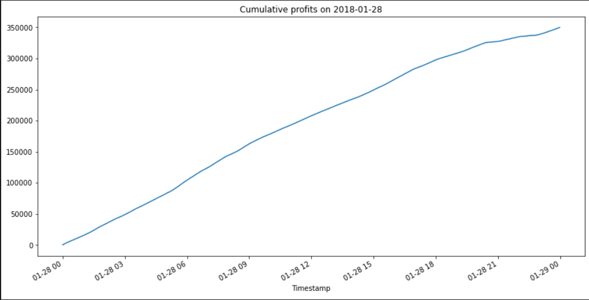

# Arbitrage Opportunities
An app that analyzes Bitcoin historical data from Bitstamp and Coinbase to find potential arbitrage opportunities and displays an interactive graph to visualize the data.

---
## Installation Guide
Using the command prompt, navigate to an empty folder where you would like to install the files and type the command:
```
git clone https://github.com/rdillens/03_Arbitrage_Opportunities.git
```
Then, to run the app type:
```
cd 03_Arbitrage_Opportunities
jupyter lab
```
**Note: You must install Jupyter Lab in your Conda environment in order to run this program.**

See the [Jupyter Lab Installation Guide](https://jupyterlab.readthedocs.io/en/stable/getting_started/installation.html) for more information.

---
## Examples
 
 <!-- 
 
 
  -->

---
## Usage
This program anaylzes historical data for Bitcoin trading prices from January 01, 2018 to March 31, 2018 on two trading platforms, Bitstamp and Coinbase. The program will determine the value of any arbitrage opportunities that exist on three different dates chosen from the dataset. The data is analyzed and graphed to show the prices.

---
## Contributors
This app is brought to you by [Remy Dillenseger](http://remyd.net).

---
## License
This project is not licensed for use by anyone other than the author, Remy Dillenseger.